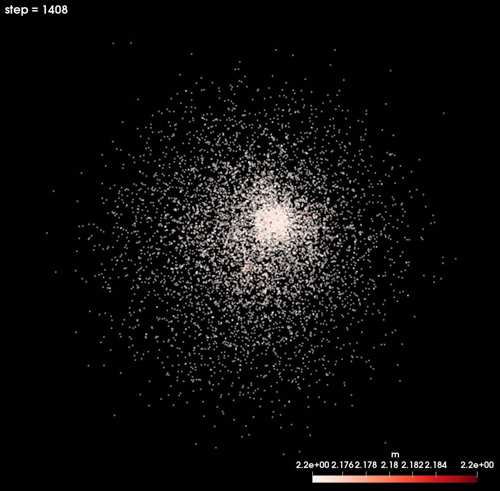
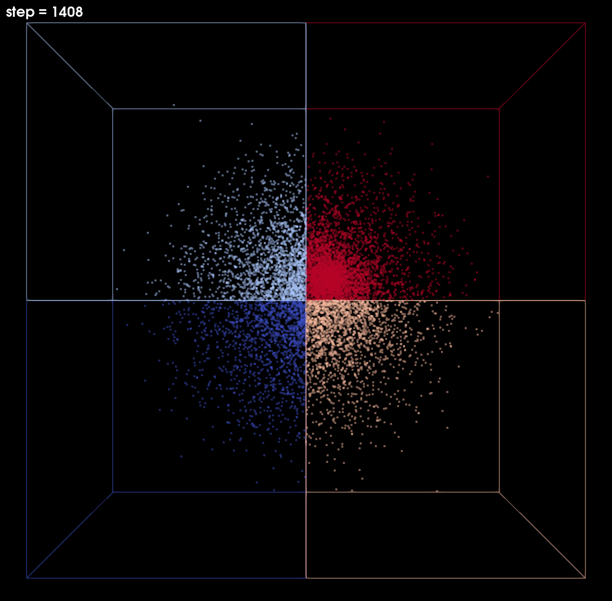

## Newton++

An MPI + OpenMP offload parallel n-body code written in C++.
The code currently implements a direct method but we are working on a tree based method.
Platform portable data structures and memory management is handled by [HAMR](https://github.com/LBL-EESA/HAMR).
The code can write its state to disk in [VTK](https://www.vtk.org) format for visualization and is instrumented with [SENSEI](https://github.com/SENSEI-insitu/SENSEI) for in situ visualziation.
The unit system is very flexible and can be specified on the command line.
The code can ingest initial conditions in the HDF5 format defined by [MAGI](https://academic.oup.com/mnras/article/475/2/2269/4791573).
A simple uniform random initial condition is built in and lets the code run with no dependencies for testing and validation.

<table>
<tr><td>

</td><td>
 
</td> </tr>
</table>

## Compiling

The build system is GNU make based.  Make files exist for different compilers
and systems. Select one of the Makefiles and modify for your system.

### Debendencies

**required:** MPI, HAMR <br>
**optional:** OpenMP, CUDA, HDF5, SENSEI <br>

It is recommended to use OpenMP offload as the CPU implemnentation is not full optimized.
When the clang compiler is used version 17 later than May 2023 is required.
When the nvidia HPC compiler is used version 23.1 or later is required.

### Makefiles

| Makefile | Status |
| -------- | ------ |
| Makefile.nvidia | NVIDIA HPC SDK build for OpenMP offlaod and CUDA. |
| Makefile.clang17 | Mainline clang build for OpenMP offload and CUDA. |
| Makefile.debug | GCC build for the CPU only. This is a good start. |

Other makefiles found in the repo may or may not work and not be maintained.

### Makefile variables

| Option | Description |
| ------ | ----------- |
| HAMR | The path to the top level directory of the HAMR install. Required. |
| CUDA | The path to the CUDA library directory. |
| USE_SENSEI | Enables the SENSEI in situ instrumentation. Optional. |
| SENSEI | The path to the top level directory (prefix) of the SENSEI install. Optional. |
| USE_MAGI | Enables the MAGI HDF5 reader. Optional. |
| HDF5_FLAGS | Sets the path for HDF5 incudes. Optional. |
| HDF5_LINK | Sets the path for HDF5 libraries. Optional. |

### Preprocessor definitions

| Defiintion | Description |
| ---------- | ----------- |
| `-DNEWTONPP_ENABLE_OMP` | Enables OpenMP offload. |
| `-DNEWTONPP_ENABLE_CUDA` | Enable CUDA optimized stream compact algorithm. OpenMP must also be enabled. |
| `-DNEWTONPP_ENABLE_MAGI` | Enable MAGI reader for initial conditions. |

### Compiling on Perlmutter

| Makefile | Status |
| -------- | ------ |
| Makefile.perlmutter.nvidia |  NVIDIA HPC SDK build for OpenMP offlaod and CUDA. |
| Makefile.perlmutter.clang | Mainline clang build for OpenMP offload and CUDA. |

#### Nvidia HPC Compiler
```bash
module swap PrgEnv-gnu/8.3.3 PrgEnv-nvidia
module swap gpu cpu
module swap nvidia/22.7 nvidia/23.1
```

#### LLVM Clang >= 17
```bash
module load llvm/nightly
```

## Running

### newtonpp command line arguments:

| Option | Description |
| ------ | ----------- |
| --G          | gravitational constant |
| --dt         | time step size |
| --eps        | softening length |
| --theta      | threshold for reduced representation |
| --n_its      | how many iterations to perform |
| --n_bodies   | the total number of bodies |
| --part_int   | how often to repartition particles |
| --magi_h5    | MAGI file with particle positions |
| --magi_sum   | MAGI file with component sizes |
| --out_dir    | where to write the results |
| --out_int    | how often to write results |
| --sensei_xml | a sensei configuration file |
| --sensei_int | how often to invoke in situ |
| --num_devs   | how many devices to use per node |
| --start_dev  | the first device to use |
| --dev_stride | the number of devices to skip |

### Using the built in uniform random initial condition
```
mpiexec -np 4 ./newtonpp_clang15_omp --n_its 1000 --out_dir ruic_out --out_int 10 --n_bodies 10000
```


### Using a MAGI initial condition
```
mpiexec -np 4 ./newtonpp_clang15_omp --magi_file /work/SENSEI/magi/bin/dat/s15.tmp0.h5 --G 4.498466e+00 --dt 0.00001 --n_its 100000000 --out_dir s15_4_gpu --out_int 1000 --eps 0.0
```


## SENSEI in-situ
Currently one needs to use the sensei_data_array branch. See [PR #101](https://github.com/SENSEI-insitu/SENSEI/pull/101).<br>
To make use of GPU's SENSEI needs to configure HAMR for OpenMP `-DHAMR_ENABLE_OPENMP -DHAMR_OPENMP_ARCH=sm_75` (cc75 if using nvc++). <br>

One can optional use both CUDA and OpenMP in SENSEI with the NVIDIA HPC compiler. <br>
Test with the sensei::Histogram and sensei::DataBinning analysis back ends. SENSEI XML configurations are included in the repo. Other back ends should work as well but these two will use CUDA. <br>


